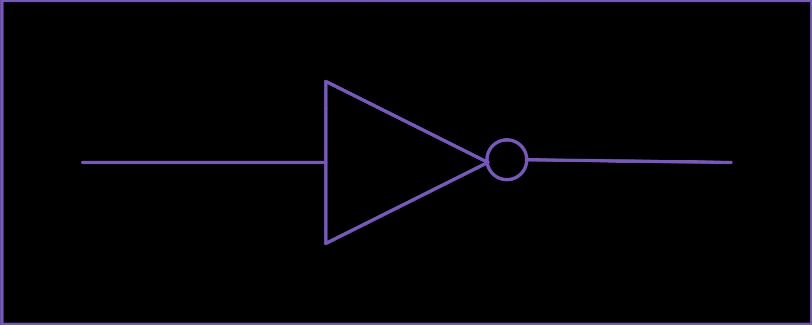
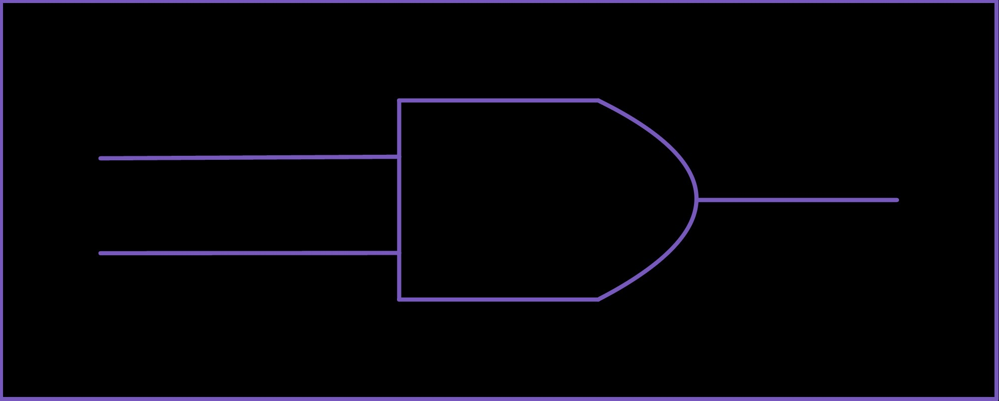
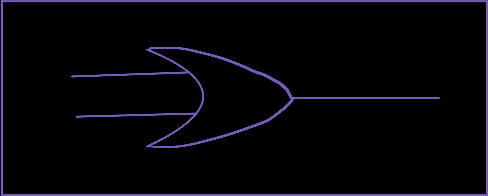
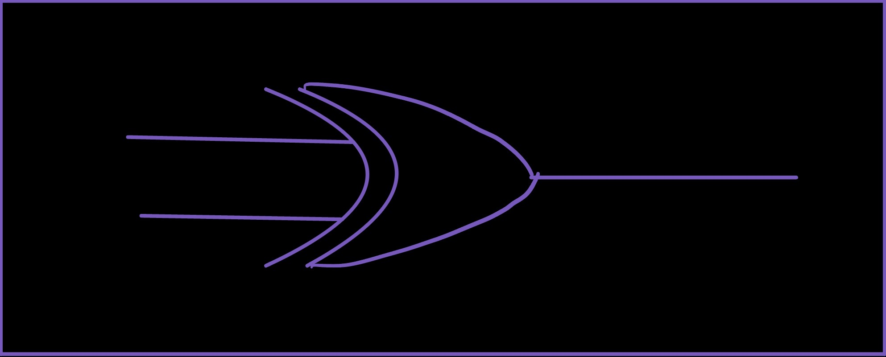
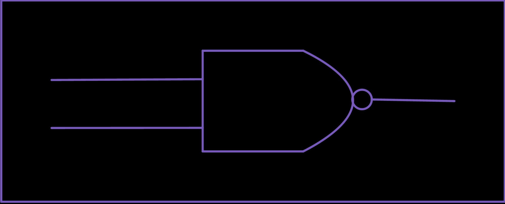
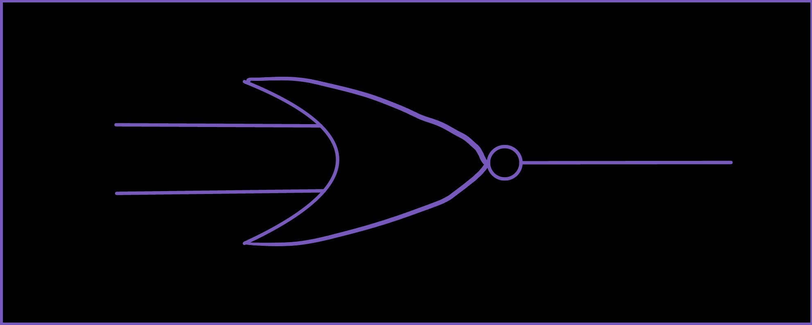
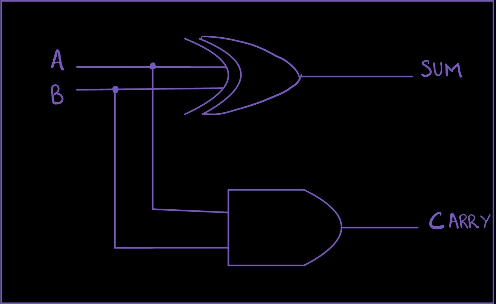

# Module 1.1: Logic Gates

**Block 1 — Combinational Logic**  
**Estimated time:** 45–60 minutes  
**Prerequisites:** None

## What you'll learn

By the end of this module you'll be able to:

- Explain what a logic gate does and why it matters
- Read and write truth tables for NOT, AND, OR, XOR, NAND, and NOR
- Express gate logic in TL-Verilog
- Run a combinational circuit in Makerchip and read its output
- Combine gates to build a simple function

## The one idea behind all of digital logic

Every circuit on every chip on every device you own is doing exactly one thing: manipulating **ones and zeros**.

That's it. A processor running a video game, a memory controller reading your files, the Wi-Fi chip sending your messages — all of it, at the lowest level, is ones and zeros being operated on by logic gates.

A **logic gate** is a circuit that takes one or more binary inputs and produces a binary output based on a fixed logical rule. Gates are the atoms of digital design. Everything else is built by combining them.

!!! note "Why ones and zeros?"
In hardware, a `1` represents a high voltage (typically ~3.3V or 1.8V depending on the technology) and a `0` represents a low voltage (close to 0V). The circuit doesn't care about the exact voltage — just whether it's "high" or "low". This binary representation is what makes digital circuits so reliable and noise-resistant.

## The NOT gate

The simplest gate. One input, one output. It **inverts** the signal.

If the input is `1`, the output is `0`.  
If the input is `0`, the output is `1`.

**Truth table:**

| A (input) | X (output) |
| --------- | ---------- |
| 0         | 1          |
| 1         | 0          |

**Circuit symbol:**



**In TL-Verilog:**

```tlv
$x = !$a;
```

That's it. One line. The `!` operator inverts the bit.

## The AND gate

Two inputs, one output. The output is `1` **only when both inputs are `1`**.  
Think of it exactly like the English word "and" — both things have to be true.

**Truth table:**

| A   | B   | X   |
| --- | --- | --- |
| 0   | 0   | 0   |
| 0   | 1   | 0   |
| 1   | 0   | 0   |
| 1   | 1   | 1   |

**Circuit symbol:**



**In TL-Verilog:**

```tlv
$x = $a && $b;
```

## The OR gate

Two inputs, one output. The output is `1` when **at least one input is `1`**.

**Truth table:**

| A   | B   | X   |
| --- | --- | --- |
| 0   | 0   | 0   |
| 0   | 1   | 1   |
| 1   | 0   | 1   |
| 1   | 1   | 1   |

**Circuit symbol:**



**In TL-Verilog:**

```tlv
$x = $a || $b;
```

## The XOR gate

XOR stands for **exclusive OR**. The output is `1` when the inputs are **different** from each other.

**Truth table:**

| A   | B   | X   |
| --- | --- | --- |
| 0   | 0   | 0   |
| 0   | 1   | 1   |
| 1   | 0   | 1   |
| 1   | 1   | 0   |

Notice the difference from OR: when both inputs are `1`, XOR gives `0`, but OR gives `1`. That's the "exclusive" part.

**Circuit symbol:**



**In TL-Verilog:**

```tlv
$x = $a ^ $b;
```

## NAND and NOR

NAND and NOR are simply AND and OR with the output **inverted** (the N stands for NOT).

**NAND truth table:**

| A   | B   | X   |
| --- | --- | --- |
| 0   | 0   | 1   |
| 0   | 1   | 1   |
| 1   | 0   | 1   |
| 1   | 1   | 0   |

**Circuit symbol:**



**NOR truth table:**

| A   | B   | X   |
| --- | --- | --- |
| 0   | 0   | 1   |
| 0   | 1   | 0   |
| 1   | 0   | 0   |
| 1   | 1   | 0   |

**Circuit symbol:**



**In TL-Verilog:**

```tlv
$x_nand = !($a && $b);
$x_nor  = !($a || $b);
```

!!! tip "NAND is universal"
You can build every other gate — AND, OR, NOT, XOR — out of NAND gates alone. This is why NAND is sometimes called a **universal gate**. In practice, chip designers sometimes implement entire logic functions using only NAND gates because it simplifies the physical layout.

## Putting gates together: the half adder

A single gate does one small thing. The real power comes from **combining gates** into more complex functions.

### What is a half adder?

A **half adder** adds two single-bit binary numbers. It takes **2 inputs** (A and B) and produces **2 outputs**:

- **S (sum):** the lower bit of A + B
- **C (carry):** the upper bit of A + B — this is the "overflow" bit that carries into the next position

Think of it like adding two single digits by hand. If you add 1 + 1, you get 2, which in binary is `10`. The `0` is your sum bit (S) and the `1` is your carry bit (C).

**Truth table:**

| A   | B   | S (sum) | C (carry) |
| --- | --- | ------- | --------- |
| 0   | 0   | 0       | 0         |
| 0   | 1   | 1       | 0         |
| 1   | 0   | 1       | 0         |
| 1   | 1   | 0       | 1         |

Look at the pattern:

- **S** is `1` only when A and B are _different_ — that's XOR
- **C** is `1` only when A and B are _both_ `1` — that's AND

So a half adder is just an XOR gate and an AND gate working together.

**Circuit diagram:**



**In TL-Verilog:**

```tlv
$s = $a ^ $b;   // XOR for sum
$c = $a && $b;  // AND for carry
```

Two lines. That's a complete half adder.

### See it running in Makerchip

Click below to open the half adder in Makerchip. The inputs A and B automatically cycle through all four combinations so you can watch the outputs change in the waveform.

<a href="http://www.makerchip.com/sandbox?code_url=https:%2F%2Fraw.githubusercontent.com%2Fin-ir%2Fmakerchip-curriculum%2Fmain%2Fcode%2Fblock-1%2Fhalf-adder.tlv" target="_blank" class="md-button">Open half adder in Makerchip ↗</a>

### How to read the Makerchip output

Once it's open and compiled, you'll see two main panels:

**The diagram tab** shows an auto-generated circuit drawn from your TL-Verilog code. Each signal you assign becomes a node. You should be able to find the XOR gate (producing `$s`) and the AND gate (producing `$c`).

**The waveform tab** shows signal values over time. Each row is a signal, each column is a clock cycle. Read it left to right:

| Cycle | $a  | $b  | $s  | $c  |
| ----- | --- | --- | --- | --- |
| 1     | 0   | 0   | 0   | 0   |
| 2     | 0   | 1   | 1   | 0   |
| 3     | 1   | 0   | 1   | 0   |
| 4     | 1   | 1   | 0   | 1   |

Verify that every row matches the truth table above. This is how hardware engineers debug circuits — they look at the waveform and check that the actual behavior matches what they expected.

!!! note "Reading the auto-generated diagram"
The Makerchip diagram shows you the direct translation of your code into circuit elements. The layout is automatic, but the logic is exactly what you wrote. As you write more complex circuits, getting comfortable reading this diagram will help you debug faster.

## Exercise: Three-input AND

**Build a circuit that outputs `1` only when all three inputs A, B, and C are `1`.**

<a href="http://www.makerchip.com/sandbox?code_url=https:%2F%2Fraw.githubusercontent.com%2Fin-ir%2Fmakerchip-curriculum%2Fmain%2Fcode%2Fblock-1%2Fthree-input-and.tlv" target="_blank" class="md-button">Open starter code in Makerchip ↗</a>

The starter code has `$x = 1'b0` as a placeholder — your output is always `0` right now. Replace that line with the correct gate logic.

Verify your circuit with all 8 combinations of A, B, C. Only the row where all three are `1` should give an output of `1`.

??? hint "Hint"
Think about it in English: "A AND B AND C". Chain two AND gates: first compute A AND B, then AND the result with C.

??? solution "Solution"
`tlv
        $x = $a && $b && $c;
        `

        TL-Verilog lets you chain `&&` directly, which is equivalent to two AND gates in sequence.

## Match the waveform

Look at the table below. Two inputs A and B produce an output X. **What gate produces this output?**

| Cycle | A   | B   | X   |
| ----- | --- | --- | --- |
| 1     | 0   | 0   | 0   |
| 2     | 0   | 1   | 1   |
| 3     | 1   | 0   | 1   |
| 4     | 1   | 1   | 0   |

Write the TL-Verilog expression for X, then open the sandbox below to verify:

<a href="http://www.makerchip.com/sandbox?code_url=https:%2F%2Fraw.githubusercontent.com%2Fin-ir%2Fmakerchip-curriculum%2Fmain%2Fcode%2Fblock-1%2Fxor-puzzle.tlv" target="_blank" class="md-button">Open puzzle in Makerchip ↗</a>

??? hint "How to read the pattern"
Look at when X goes high. It's `1` in cycles 2 and 3 — when A and B are _different_. When they're the same (both 0 in cycle 1, both 1 in cycle 4), X is `0`.

    Which gate gives `1` when inputs are different?

??? solution "Solution"
`tlv
        $x = $a ^ $b;  // XOR
        `

        Reading signal patterns backwards into code is one of the most important debugging skills in hardware design. When something in your circuit misbehaves, you read its waveform and ask: "what logic would produce this pattern?"

## Where this fits next

You now know the fundamental building blocks of all combinational logic. Every circuit — no matter how complex — is built from these gates.

In **Module 1.2**, you'll meet the **multiplexer (MUX)**: a circuit that acts as a programmable switch. It's one of the most useful building blocks in digital design, and you'll use it constantly from here on.

## Quick reference

| Gate | TL-Verilog      | Output is `1` when...     |
| ---- | --------------- | ------------------------- |
| NOT  | `!$a`           | input is `0`              |
| AND  | `$a && $b`      | both inputs are `1`       |
| OR   | `$a \|\| $b`    | at least one input is `1` |
| XOR  | `$a ^ $b`       | inputs are different      |
| NAND | `!($a && $b)`   | NOT both inputs are `1`   |
| NOR  | `!($a \|\| $b)` | both inputs are `0`       |
