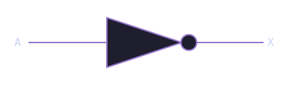
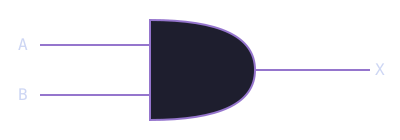
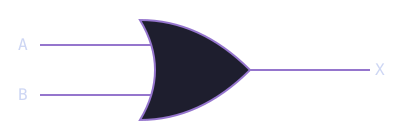
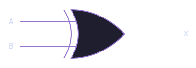
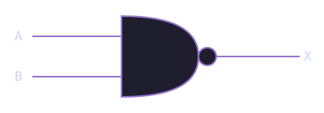
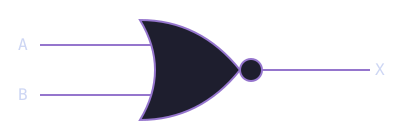
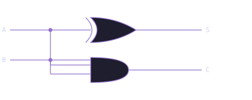

# Module 1.1: Logic Gates

**Block 1 — Combinational Logic**  
**Estimated time:** 45–60 minutes  
**Prerequisites:** None

## What you'll learn

By the end of this module you will be able to explain what a logic gate does and why it matters, read and write truth tables for NOT, AND, OR, XOR, NAND, and NOR, express gate logic in TL-Verilog, run a combinational circuit in Makerchip and read its output, and combine gates to build a simple function.

## The one idea behind all of digital logic

Every circuit on every chip on every device you own is doing exactly one thing: manipulating **ones and zeros**.

A processor running a video game, a memory controller reading your files, the Wi-Fi chip sending your messages: all of it, at the lowest level, is ones and zeros being operated on by logic gates.

A **logic gate** is a circuit that takes one or more binary inputs and produces a binary output based on a fixed logical rule. Gates are the atoms of digital design. Everything else is built by combining them.

!!! note "Why ones and zeros?"

    In hardware, a `1` represents a high voltage (typically around 3.3V or 1.8V depending on the technology) and a `0` represents a low voltage close to 0V. The circuit does not care about the exact voltage, only whether it is high or low. This binary representation is what makes digital circuits so reliable and noise-resistant.

## The NOT gate

The simplest gate. One input, one output. It **inverts** the signal: if the input is `1`, the output is `0`, and vice versa.

**Truth table:**

| A (input) | X (output) |
| --------- | ---------- |
| 0         | 1          |
| 1         | 0          |

**Circuit symbol:**



**In TL-Verilog:**

```tlv
$x = !$a;
```

One line. The `!` operator inverts the bit.

## The AND gate

Two inputs, one output. The output is `1` **only when both inputs are `1`**. Think of it exactly like the English word "and": both things have to be true.

**Truth table:**

| A   | B   | X   |
| --- | --- | --- |
| 0   | 0   | 0   |
| 0   | 1   | 0   |
| 1   | 0   | 0   |
| 1   | 1   | 1   |

**Circuit symbol:**



**In TL-Verilog:**

```tlv
$x = $a && $b;
```

## The OR gate

Two inputs, one output. The output is `1` when **at least one input is `1`**.

**Truth table:**

| A   | B   | X   |
| --- | --- | --- |
| 0   | 0   | 0   |
| 0   | 1   | 1   |
| 1   | 0   | 1   |
| 1   | 1   | 1   |

**Circuit symbol:**



**In TL-Verilog:**

```tlv
$x = $a || $b;
```

## The XOR gate

XOR stands for **exclusive OR**. The output is `1` when the inputs are **different** from each other. Notice the key distinction from OR: when both inputs are `1`, XOR gives `0` where OR gives `1`. That is the "exclusive" part.

**Truth table:**

| A   | B   | X   |
| --- | --- | --- |
| 0   | 0   | 0   |
| 0   | 1   | 1   |
| 1   | 0   | 1   |
| 1   | 1   | 0   |

**Circuit symbol:**



**In TL-Verilog:**

```tlv
$x = $a ^ $b;
```

## NAND and NOR

NAND and NOR are simply AND and OR with the output **inverted**. The N stands for NOT.

**NAND truth table:**

| A   | B   | X   |
| --- | --- | --- |
| 0   | 0   | 1   |
| 0   | 1   | 1   |
| 1   | 0   | 1   |
| 1   | 1   | 0   |

**Circuit symbol:**



**NOR truth table:**

| A   | B   | X   |
| --- | --- | --- |
| 0   | 0   | 1   |
| 0   | 1   | 0   |
| 1   | 0   | 0   |
| 1   | 1   | 0   |

**Circuit symbol:**



**In TL-Verilog:**

```tlv
$x_nand = !($a && $b);
$x_nor  = !($a || $b);
```

!!! tip "NAND is universal"

    You can build every other gate (AND, OR, NOT, XOR) out of NAND gates alone. In fact, any combinational logic function can be expressed using only NAND gates. This is why NAND is called a **universal gate**. Chip designers sometimes implement entire logic functions using only NAND gates because it simplifies the physical layout.

## See all gates in action

Now that you know each gate, here they all are together. Use the slider and arrow buttons to step through different input combinations and watch how each gate responds.

<div id="mc-logic-gates" class="makerchip-embed"></div>

## Putting gates together: the half adder

A single gate does one small thing. The real power comes from **combining gates** into more complex functions.

### What is a half adder?

A **half adder** adds two single-bit binary numbers. It takes two inputs (A and B) and produces two outputs. The **sum** S is the lower bit of A + B, and the **carry** C is the upper bit, the overflow that carries into the next position.

Think of it like adding two single digits by hand. If you add 1 + 1, you get 2, which in binary is `10`. The `0` is your sum bit and the `1` is your carry bit.

**Truth table:**

| A   | B   | S (sum) | C (carry) |
| --- | --- | ------- | --------- |
| 0   | 0   | 0       | 0         |
| 0   | 1   | 1       | 0         |
| 1   | 0   | 1       | 0         |
| 1   | 1   | 0       | 1         |

Look at the pattern. S is `1` only when A and B are different, which is XOR. C is `1` only when both A and B are `1`, which is AND. A half adder is simply an XOR gate and an AND gate working together.

**Circuit diagram:**



**In TL-Verilog:**

```tlv
$s = $a ^ $b;   // XOR for sum
$c = $a && $b;  // AND for carry
```

Two lines. That is a complete half adder.

### See the half adder circuit in Makerchip

The embed below shows the half adder circuit on the left and the waveform on the right. Find the XOR gate producing `$s` and the AND gate producing `$c`. In the waveform, verify that the outputs match the truth table above as the inputs change over time.

<div id="mc-half-adder" class="makerchip-embed"></div>

??? note "What are `clk` and `reset`?"

    Makerchip always shows `clk` and `reset` in the waveform. Ignore them for now. Combinational circuits do not depend on a clock. The output responds instantly to the inputs. You will learn what the clock does when we get to sequential logic in Block 2.

## Match the waveform

Look at the waveform below. Two inputs A and B produce an output X. Study how X changes as A and B change, and determine what gate produces this output.

<div id="mc-and-waveform" class="makerchip-embed-small"></div>

Write the TL-Verilog expression for X, then verify it in the exercise below.

??? hint "How to read the pattern"

    Watch when X goes high. X is `1` when A and B are different, and `0` when they are the same. Which gate gives `1` when inputs are different?

??? solution "Solution"

    ```tlv
    $x = $a ^ $b;  // XOR
    ```

    Reading signal patterns backwards into code is one of the most important debugging skills in hardware design. When something in your circuit misbehaves, you read its waveform and ask: what logic would produce this pattern?

## Exercise: Code the XOR gate

Now write it yourself. The editor below has a placeholder output that is always `0`. Replace `$x = 1'b0` with the correct gate logic and compile. Check the waveform to verify your answer.

<div id="mc-xor-exercise" class="makerchip-embed"></div>

??? hint "Hint"

    Which gate outputs `1` when inputs are different? Think back to the XOR gate we covered earlier.

??? solution "Solution"

    ```tlv
    $x = $a ^ $b;
    ```

## Exercise: Three-input AND

Build a circuit that outputs `1` only when all three inputs A, B, and C are `1`.

<div id="mc-three-input-and" class="makerchip-embed"></div>

The starter code has `$x = 1'b0` as a placeholder. Replace that line with the correct gate logic and verify in the waveform that only the combination where all three inputs are `1` gives an output of `1`.

??? hint "Hint"

    Think about it in plain English: A AND B AND C. Chain two AND gates. First compute A AND B, then AND the result with C.

??? solution "Solution"

    ```tlv
    $x = $a && $b && $c;
    ```

    TL-Verilog lets you chain `&&` directly, which is equivalent to two AND gates in sequence.

## Where this fits next

You now know the fundamental building blocks of all combinational logic. Every circuit, no matter how complex, is built from these gates.

In Module 1.2 you will meet the **multiplexer (MUX)**, a circuit that acts as a programmable switch. It is one of the most useful building blocks in digital design and you will use it constantly from here on.

## Quick reference

| Gate | TL-Verilog      | Output is `1` when...     |
| ---- | --------------- | ------------------------- |
| NOT  | `!$a`           | input is `0`              |
| AND  | `$a && $b`      | both inputs are `1`       |
| OR   | `$a \|\| $b`    | at least one input is `1` |
| XOR  | `$a ^ $b`       | inputs are different      |
| NAND | `!($a && $b)`   | NOT both inputs are `1`   |
| NOR  | `!($a \|\| $b)` | both inputs are `0`       |

<style>
.makerchip-embed       { position: relative; width: 100%; height: 500px; }
.makerchip-embed-small { position: relative; width: 100%; height: 333px; }
</style>

<script type="module">
  import IdePlugin from 'https://beta.makerchip.com/dist/makerchip-plugin.js';

  const base = 'https://raw.githubusercontent.com/in-ir/makerchip-curriculum/main/code/block-1/';

  class VizOnlyIDE extends IdePlugin {
    async onReady() {
      await this.setLayoutState({
        panes: ['Viz'],
        activePane: 'Viz'
      });
    }
  }

  class DiagramWaveformIDE extends IdePlugin {
    async onReady() {
      await this.setLayoutState({
        sides: {
          left:  { panes: ['Diagram'],  activePane: 'Diagram'  },
          right: { panes: ['Waveform'], activePane: 'Waveform' }
        },
        splitAt: 0.5
      });
    }
  }

  class WaveformOnlyIDE extends IdePlugin {
    async onReady() {
      await this.setLayoutState({
        panes: ['Waveform'],
        activePane: 'Waveform'
      });
      await this.compile();
    }
  }

  class EditorWaveformIDE extends IdePlugin {
    async onReady() {
      await this.setLayoutState({
        sides: {
          left:  { panes: ['Editor'],   activePane: 'Editor'   },
          right: { panes: ['Waveform'], activePane: 'Waveform' }
        },
        splitAt: 0.5
      });
    }
  }

  if (document.getElementById('mc-logic-gates')) {
    VizOnlyIDE.create('mc-logic-gates', {
      codeURL: 'https://cdn.jsdelivr.net/gh/stevehoover/makerchip_examples@a0d80f640661653639c05de49fb8df76e9616f5c/logic_gates.tlv'
    });
  }

  if (document.getElementById('mc-half-adder')) {
    DiagramWaveformIDE.create('mc-half-adder', {
      codeURL: base + 'half-adder.tlv'
    });
  }

  if (document.getElementById('mc-and-waveform')) {
    WaveformOnlyIDE.create('mc-and-waveform', {
      codeURL: base + 'xor-puzzle.tlv'
    });
  }

  if (document.getElementById('mc-xor-exercise')) {
    EditorWaveformIDE.create('mc-xor-exercise', {
      codeURL: base + 'xor-exercise.tlv'
    });
  }

  if (document.getElementById('mc-three-input-and')) {
    EditorWaveformIDE.create('mc-three-input-and', {
      codeURL: base + 'three-input-and.tlv'
    });
  }
</script>

