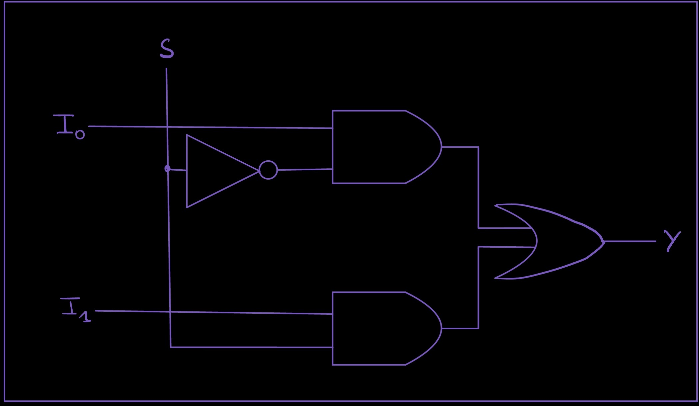

# Module 1.2: The Multiplexer (MUX)

**Block 1 — Combinational Logic**  
**Estimated time:** 45–60 minutes  
**Prerequisites:** Module 1.1 — Logic Gates

## What you'll learn

By the end of this module you'll be able to:

- Explain what a multiplexer does and why it's useful
- Read and write a 2-to-1 MUX in TL-Verilog using the ternary operator
- Scale a 2-to-1 MUX to a 4-to-1 MUX using chained conditions
- Use a MUX to select between signals in a circuit
- Solve a MUX-based design challenge

## The idea: a programmable switch

You now know how logic gates work. Gates are fixed — an AND gate always ANDs, an OR gate always ORs. But what if you want a circuit that can **choose** what it does based on a control signal?

That's a **multiplexer**, or **MUX**.

A MUX is a circuit that selects one of several input signals and forwards it to the output. The selection is controlled by one or more **select lines**.

Think of it like a railway switch. Multiple tracks come in, but only one is routed forward — and the switch lever (the select signal) decides which one.

MUXes are everywhere in digital design. Every time a processor chooses between two values, every time a circuit picks a path — there's almost certainly a MUX doing the work.

## The 2-to-1 MUX

The simplest MUX: **two inputs, one select line, one output**.

| SEL | Output |
| --- | ------ |
| 0   | A      |
| 1   | B      |

When SEL is `0`, the output is whatever A is. When SEL is `1`, the output is whatever B is.

**Circuit symbol:**



**In TL-Verilog:**

```tlv
$out = $sel ? $b : $a;
```

This uses the **ternary operator** — the same `?:` you might know from C or Python. Read it as: "if SEL is true, output B, otherwise output A."

One line. That's a complete 2-to-1 MUX.

!!! note "Why ternary?"
TL-Verilog (and Verilog) uses `?:` for MUX-like selection because it maps directly to hardware. The synthesizer sees `condition ? x : y` and produces exactly a MUX circuit. It's not just shorthand — it's the idiomatic way to describe selection in hardware.

### See it running in Makerchip

Click below to open the 2-to-1 MUX in Makerchip. The inputs A, B, and SEL automatically cycle through combinations so you can watch the output switch between them in the waveform.

<a href="http://www.makerchip.com/sandbox?code_url=https:%2F%2Fraw.githubusercontent.com%2Fin-ir%2Fmakerchip-curriculum%2Fmain%2Fcode%2Fblock-1%2F2to1-mux.tlv" target="_blank" class="md-button">Open 2-to-1 MUX in Makerchip ↗</a>

### How to read the waveform

Watch the `$out` signal. It should match `$a` whenever `$sel` is `0`, and match `$b` whenever `$sel` is `1`.

| Cycle | $sel | $a  | $b  | $out |
| ----- | ---- | --- | --- | ---- |
| 1     | 0    | 0   | 1   | 0    |
| 2     | 0    | 1   | 0   | 1    |
| 3     | 1    | 0   | 1   | 1    |
| 4     | 1    | 1   | 0   | 0    |

In cycles 1 and 2, SEL is `0` so the output follows A. In cycles 3 and 4, SEL is `1` so the output follows B. The select line is the lever; A and B are the tracks.

## Scaling up: the 4-to-1 MUX

What if you have four inputs and want to select between them? You need **two select lines** — because two bits give you four combinations (00, 01, 10, 11).

**Selection table:**

| SEL[1:0] | Output |
| -------- | ------ |
| 00       | A      |
| 01       | B      |
| 10       | C      |
| 11       | D      |

**In TL-Verilog**, you chain conditions using `==`:

```tlv
$out = $sel == 2'b11 ? $d :
       $sel == 2'b10 ? $c :
       $sel == 2'b01 ? $b :
                       $a;
```

Read it top to bottom: check each value of SEL in order, and output the matching signal. The last line is the default — if none of the conditions above matched, output A.

!!! tip "MUX trees"
You can keep extending this pattern for as many inputs as you need. An 8-to-1 MUX checks 8 conditions with a 3-bit select. The structure stays the same — one condition per input, a default at the bottom.

## Exercise: Build a 4-to-1 MUX with logic output

**The task:** Build a 4-to-1 MUX where each input is a logic expression:

- When `$sel == 2'b00`, output `$x AND $y`
- When `$sel == 2'b01`, output `$x OR $y`
- When `$sel == 2'b10`, output `NOT $x`
- When `$sel == 2'b11`, output `$x XOR $y`

<a href="http://www.makerchip.com/sandbox?code_url=https:%2F%2Fraw.githubusercontent.com%2Fin-ir%2Fmakerchip-curriculum%2Fmain%2Fcode%2Fblock-1%2Fmux-exercise.tlv" target="_blank" class="md-button">Open starter code in Makerchip ↗</a>

The starter code has `$out = 1'b0` as a placeholder. Replace it with the correct MUX logic.

??? hint "Hint"
Break it into two steps. First compute all four expressions as intermediate signals:

    ```tlv
    $and = $x && $y;
    $or  = $x || $y;
    $not = !$x;
    $xor = $x ^ $y;
    ```

    Then chain them into a 4-to-1 MUX using `==` conditions.

??? solution "Solution"
```tlv
$and = $x && $y;
    $or  = $x || $y;
    $not = !$x;
$xor = $x ^ $y;

    $out = $sel == 2'b11 ? $xor :
           $sel == 2'b10 ? $not :
           $sel == 2'b01 ? $or  :
                           $and;
    ```

    Compute your signals first, then select between them. This separation keeps the gate logic and the selection logic clean and easy to read.

## Challenge: 2-bit function selector

**Build a circuit that applies a different operation depending on a 2-bit opcode.**

You have two 1-bit inputs `$a` and `$b`, and a 2-bit opcode `$op[1:0]`. Based on the opcode, the output should be:

| $op | Output      |
| --- | ----------- |
| 00  | `$a AND $b` |
| 01  | `$a OR $b`  |
| 10  | `$a XOR $b` |
| 11  | `NOT $a`    |

This is a simplified ALU — a circuit that selects between operations based on a control code. You'll build a full one in Module 1.5.

<a href="http://www.makerchip.com/sandbox?code_url=https:%2F%2Fraw.githubusercontent.com%2Fin-ir%2Fmakerchip-curriculum%2Fmain%2Fcode%2Fblock-1%2Fmux-challenge.tlv" target="_blank" class="md-button">Open challenge starter code in Makerchip ↗</a>

??? hint "Hint"
Same pattern as the exercise — compute all four results first as intermediate signals, then use `$op` as your select to choose between them.

??? solution "Solution"
```tlv
$and = $a && $b;
    $or  = $a || $b;
    $xor = $a ^ $b;
    $not = !$a;

    $out = $op == 2'b11 ? $not :
           $op == 2'b10 ? $xor :
           $op == 2'b01 ? $or  :
                          $and;
    ```

    Notice that `NOT` only uses `$a` — `$b` is ignored when `$op == 2'b11`. That's fine; in a real ALU some operations don't use all inputs.

## Where this fits next

You now have two of the most important combinational building blocks: **gates** and **MUXes**. These two alone can express any combinational logic function.

In **Module 1.5**, you'll combine them into an **ALU** — an Arithmetic Logic Unit — the circuit at the heart of every processor. It's a MUX that selects between several operations based on an opcode. You already built a mini version of it in the challenge above.

## Quick reference

| Circuit    | TL-Verilog                        | What it does                              |
| ---------- | --------------------------------- | ----------------------------------------- |
| 2-to-1 MUX | `$out = $sel ? $b : $a`           | Select A or B based on SEL                |
| 4-to-1 MUX | `$out = $sel == 2'b11 ? $d : ...` | Select between inputs using == conditions |
