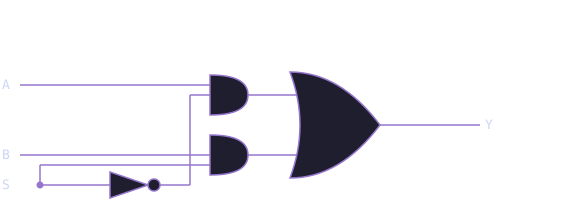

# Module 1.2: The Multiplexer (MUX)

**Block 1 — Combinational Logic**  
**Estimated time:** 45–60 minutes  
**Prerequisites:** Module 1.1 — Logic Gates

## What you'll learn

By the end of this module you will be able to explain what a multiplexer does and why it is useful, read and write a 2-to-1 MUX in TL-Verilog using the ternary operator, scale a 2-to-1 MUX to a 4-to-1 MUX using chained conditions, use a MUX to select between signals in a circuit, and solve a MUX-based design challenge.

## A programmable switch

You now know how logic gates work. Gates are fixed: an AND gate always ANDs, an OR gate always ORs. But what if you want a circuit that can **choose** what it does based on a control signal?

That is what a **multiplexer**, or **MUX**, does.

A MUX is a circuit that selects one of several input signals and forwards it to the output. The selection is controlled by one or more **select lines**. Think of it like a railway switch. Multiple tracks come in, but only one is routed forward, and the switch lever decides which one.

MUXes are everywhere in digital design. Every time a processor chooses between two values or a circuit picks a path, there is almost certainly a MUX doing that work.

## The 2-to-1 MUX

The simplest MUX has two inputs, one select line, and one output.

| SEL | Output |
| --- | ------ |
| 0   | A      |
| 1   | B      |

When SEL is `0`, the output is whatever A is. When SEL is `1`, the output is whatever B is.

**Circuit symbol:**



**See it in action:**

The visualization below shows the MUX responding to live inputs. Watch how the active input wire lights up and the output follows the selected input as SEL changes.

<div id="mc-mux-viz" class="makerchip-embed"></div>

**In TL-Verilog:**

```tlv
$out = $sel ? $b : $a;
```

This uses the **ternary operator**, the same `?:` you may know from C or Python. Read it as: if SEL is true, output B, otherwise output A. One line. That is a complete 2-to-1 MUX.

??? note "Why ternary?"

    TL-Verilog uses `?:` for MUX-like selection because it maps directly to hardware. The synthesizer sees `condition ? x : y` and produces exactly a MUX circuit. It is not just shorthand. It is the idiomatic way to describe selection in hardware description languages.

### See the MUX circuit in Makerchip

The embed below shows the 2-to-1 MUX circuit and its waveform. Watch the `$out` signal: it follows `$a` when `$sel` is `0` and follows `$b` when `$sel` is `1`.

<div id="mc-mux-demo" class="makerchip-embed"></div>

??? note "What are `clk` and `reset`?"

    Makerchip always shows `clk` and `reset` in the waveform. Ignore them for now. Combinational circuits do not depend on a clock. The output responds instantly to the inputs. You will learn what the clock does when we get to sequential logic in Block 2.

## Match the waveform

Look at the waveform below. Three signals `$a`, `$b`, and `$sel` produce an output `$out`. Study how `$out` changes relative to `$sel` and determine what the relationship is.

<div id="mc-mux-waveform" class="makerchip-embed-small"></div>

Write the TL-Verilog expression for `$out`, then verify it in the exercise below. Try to match the same select input pattern you see in the waveform above.

??? tip "How to read the pattern"

    When `$sel` is `0`, `$out` matches `$a`. When `$sel` is `1`, `$out` matches `$b`. The output always tracks one of the two inputs. Which one depends on `$sel`. Which operator selects between two values based on a condition?

??? success "Solution"

    ```tlv
    $out = $sel ? $b : $a;
    ```

    When `$sel` is `0` the output follows `$a`. When `$sel` is `1` it follows `$b`. This is exactly the ternary operator mapping to a 2-to-1 MUX.

## Exercise: Code the 2-to-1 MUX

Now write it yourself. Replace `$out = 1'b0` with the correct MUX logic and compile. Check that the waveform matches the pattern above.

<div id="mc-mux-exercise-basic" class="makerchip-embed"></div>

??? tip "Hint"

    Use the ternary operator: `condition ? value_if_true : value_if_false`. What is the condition here? What are the two values to choose between?

??? success "Solution"

    ```tlv
    $out = $sel ? $b : $a;
    ```

## Scaling up: the 4-to-1 MUX

What if you have four inputs and want to select between them? You need two select lines, because two bits give you four combinations: 00, 01, 10, and 11.

**Selection table:**

| SEL[1:0] | Output |
| -------- | ------ |
| 00       | A      |
| 01       | B      |
| 10       | C      |
| 11       | D      |

In TL-Verilog, you chain conditions using `==`:

```tlv
$out = $sel == 2'b11 ? $d :
       $sel == 2'b10 ? $c :
       $sel == 2'b01 ? $b :
                       $a;
```

Read it top to bottom: check each value of SEL in order and output the matching signal. The last line is the default. If none of the conditions above matched, output A.

!!! tip "MUX trees"

    You can extend this pattern for as many inputs as you need. An 8-to-1 MUX checks 8 conditions with a 3-bit select. The structure stays the same: one condition per input, a default at the bottom.

## Exercise: Build a 4-to-1 MUX with logic output

Build a 4-to-1 MUX where each input is a logic expression. When `$sel == 2'b00`, output `$x AND $y`. When `$sel == 2'b01`, output `$x OR $y`. When `$sel == 2'b10`, output `NOT $x`. When `$sel == 2'b11`, output `$x XOR $y`.

<div id="mc-mux-exercise" class="makerchip-embed"></div>

The starter code has `$out = 1'b0` as a placeholder. Replace it with the correct MUX logic.

??? tip "Hint"

    Break it into two steps. First compute all four expressions as intermediate signals:

    ```tlv
    $and = $x && $y;
    $or  = $x || $y;
    $not = !$x;
    $xor = $x ^ $y;
    ```

    Then chain them into a 4-to-1 MUX using `==` conditions.

??? success "Solution"

    ```tlv
    $and = $x && $y;
    $or  = $x || $y;
    $not = !$x;
    $xor = $x ^ $y;

    $out = $sel == 2'b11 ? $xor :
           $sel == 2'b10 ? $not :
           $sel == 2'b01 ? $or  :
                           $and;
    ```

    Compute your signals first, then select between them. This keeps the gate logic and the selection logic clean and easy to read.

## Challenge: 2-bit function selector

Build a circuit that applies a different operation depending on a 2-bit opcode. You have two 1-bit inputs `$a` and `$b`, and a 2-bit opcode `$op[1:0]`. Based on the opcode, the output should be:

| $op | Output      |
| --- | ----------- |
| 00  | `$a AND $b` |
| 01  | `$a OR $b`  |
| 10  | `$a XOR $b` |
| 11  | `NOT $a`    |

This is a simplified **Arithmetic Logic Unit (ALU)**, a circuit that selects between operations based on a control code. You will build a full one in Module 1.4.

<div id="mc-mux-challenge" class="makerchip-embed"></div>

??? tip "Hint"

    Same pattern as the exercise. Compute all four results first as intermediate signals, then use `$op` as your select to choose between them.

??? success "Solution"

    ```tlv
    $and = $a && $b;
    $or  = $a || $b;
    $xor = $a ^ $b;
    $not = !$a;

    $out = $op == 2'b11 ? $not :
           $op == 2'b10 ? $xor :
           $op == 2'b01 ? $or  :
                          $and;
    ```

    Notice that NOT only uses `$a`. When `$op == 2'b11`, `$b` is ignored entirely. That is perfectly fine. In a real ALU, some operations do not use all inputs.

## Where this fits next

You now have two of the most important combinational building blocks: gates and MUXes. Together, they can be combined to implement any combinational logic function.

In Module 1.3 you will meet the **decoder**, a circuit that takes a binary number and activates exactly one output line. It shows up inside ALUs, memory addressing, and instruction decoding in real processors.

## Quick reference

| Circuit     | TL-Verilog                        | What it does                              |
| ----------- | --------------------------------- | ----------------------------------------- |
| 2-to-1 MUX  | `$out = $sel ? $b : $a`           | Select A or B based on SEL                |
| 4-to-1 MUX  | `$out = $sel == 2'b11 ? $d : ...` | Select between inputs using == conditions |

<style>
.makerchip-embed       { position: relative; width: 100%; height: 500px; }
.makerchip-embed-small { position: relative; width: 100%; height: 333px; }
</style>

<script type="module">
  import IdePlugin from 'https://beta.makerchip.com/dist/makerchip-plugin.js';

  const base = 'https://raw.githubusercontent.com/in-ir/makerchip-curriculum/main/code/block-1/';

  class VizOnlyIDE extends IdePlugin {
    async onReady() {
      await this.setLayoutState({
        panes: ['Viz'],
        activePane: 'Viz'
      });
    }
  }

  class DiagramWaveformIDE extends IdePlugin {
    async onReady() {
      await this.setLayoutState({
        sides: {
          left:  { panes: ['Diagram'],  activePane: 'Diagram'  },
          right: { panes: ['Waveform'], activePane: 'Waveform' }
        },
        splitAt: 0.5
      });
    }
  }

  class WaveformOnlyIDE extends IdePlugin {
    async onReady() {
      await this.setLayoutState({
        panes: ['Waveform'],
        activePane: 'Waveform'
      });
      await this.compile();
    }
  }

  class EditorWaveformIDE extends IdePlugin {
    async onReady() {
      await this.setLayoutState({
        sides: {
          left:  { panes: ['Editor'],   activePane: 'Editor'   },
          right: { panes: ['Waveform'], activePane: 'Waveform' }
        },
        splitAt: 0.5
      });
    }
  }

  if (document.getElementById('mc-mux-viz')) {
    VizOnlyIDE.create('mc-mux-viz', {
      codeURL: base + '2to1-mux-viz.tlv'
    });
  }

  if (document.getElementById('mc-mux-demo')) {
    DiagramWaveformIDE.create('mc-mux-demo', {
      codeURL: base + '2to1-mux.tlv'
    });
  }

  if (document.getElementById('mc-mux-waveform')) {
    WaveformOnlyIDE.create('mc-mux-waveform', {
      codeURL: base + '2to1-mux.tlv'
    });
  }

  if (document.getElementById('mc-mux-exercise-basic')) {
    EditorWaveformIDE.create('mc-mux-exercise-basic', {
      codeURL: base + 'mux-exercise-basic.tlv'
    });
  }

  if (document.getElementById('mc-mux-exercise')) {
    EditorWaveformIDE.create('mc-mux-exercise', {
      codeURL: base + 'mux-exercise.tlv'
    });
  }

  if (document.getElementById('mc-mux-challenge')) {
    EditorWaveformIDE.create('mc-mux-challenge', {
      codeURL: base + 'mux-challenge.tlv'
    });
  }
</script>
