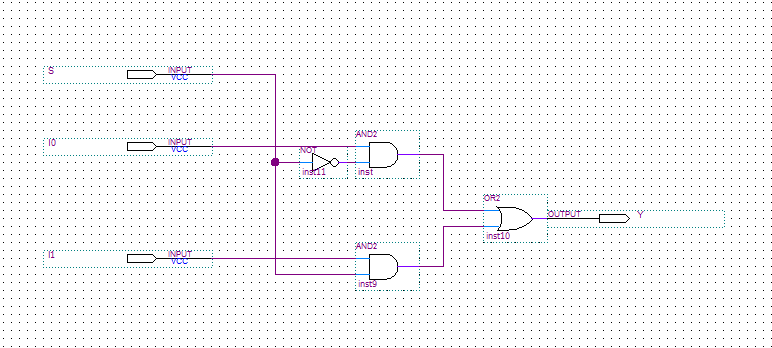

# Module 1.2: The Multiplexer (MUX)

**Block 1 — Combinational Logic**  
**Estimated time:** 45–60 minutes  
**Prerequisites:** Module 1.1 — Logic Gates

---

## What you'll learn

By the end of this module you'll be able to:

- Explain what a multiplexer does and why it's useful
- Read and write a 2-to-1 MUX in TL-Verilog using the ternary operator
- Scale a 2-to-1 MUX to a 4-to-1 MUX by chaining
- Use a MUX to select between signals in a circuit
- Solve a MUX-based design challenge

---

## The idea: a programmable switch

You now know how logic gates work. Gates are fixed — an AND gate always ANDs, an OR gate always ORs. But what if you want a circuit that can **choose** what it does based on a control signal?

That's a **multiplexer**, or **MUX**.

A MUX is a circuit that selects one of several input signals and forwards it to the output. The selection is controlled by one or more **select lines**.

Think of it like a railway switch. Multiple tracks come in, but only one is routed forward — and the switch lever (the select signal) decides which one.

MUXes are everywhere in digital design. Every time a processor chooses between two values, every time a circuit picks a path — there's almost certainly a MUX doing the work.

---

## The 2-to-1 MUX

The simplest MUX: **two inputs, one select line, one output**.

| SEL | Output |
| --- | ------ |
| 0   | A      |
| 1   | B      |

When SEL is `0`, the output is whatever A is. When SEL is `1`, the output is whatever B is.

**Circuit symbol:**



**In TL-Verilog:**

```tlv
$out = $sel ? $b : $a;
```

This uses the **ternary operator** — the same `?:` you might know from C or Python. Read it as: "if SEL is true, output B, otherwise output A."

One line. That's a complete 2-to-1 MUX.

!!! note "Why ternary?"
    TL-Verilog (and Verilog) uses `?:` for MUX-like selection because it maps directly to hardware. The synthesizer sees `condition ? x : y` and produces exactly a MUX circuit. It's not just shorthand — it's the idiomatic way to describe selection in hardware.

### See it running in Makerchip

Click below to open the 2-to-1 MUX in Makerchip. The inputs A, B, and SEL automatically cycle through combinations so you can watch the output switch between them in the waveform.

<a href="http://www.makerchip.com/sandbox?code_url=https:%2F%2Fraw.githubusercontent.com%2Fin-ir%2Fmakerchip-curriculum%2Fmain%2Fcode%2Fblock-1%2F2to1-mux.tlv" target="_blank" class="md-button">Open 2-to-1 MUX in Makerchip ↗</a>

### How to read the waveform

Watch the `$out` signal. It should match `$a` whenever `$sel` is `0`, and match `$b` whenever `$sel` is `1`.

| Cycle | $sel | $a | $b | $out |
| ----- | ---- | -- | -- | ---- |
| 1     | 0    | 0  | 1  | 0    |
| 2     | 0    | 1  | 0  | 1    |
| 3     | 1    | 0  | 1  | 1    |
| 4     | 1    | 1  | 0  | 0    |

In cycles 1 and 2, SEL is `0` so the output follows A. In cycles 3 and 4, SEL is `1` so the output follows B. The select line is the lever; A and B are the tracks.

---

## Scaling up: the 4-to-1 MUX

What if you have four inputs and want to select between them? You need **two select lines** — because two bits give you four combinations (00, 01, 10, 11).

**Selection table:**

| SEL[1] | SEL[0] | Output |
| ------ | ------ | ------ |
| 0      | 0      | A      |
| 0      | 1      | B      |
| 1      | 0      | C      |
| 1      | 1      | D      |

**In TL-Verilog**, you chain ternary operators:

```tlv
$out = $sel[1] ? ($sel[0] ? $d : $c)
               : ($sel[0] ? $b : $a);
```

Read it from the outside in:
- If SEL[1] is `1`, choose between C and D using SEL[0]
- If SEL[1] is `0`, choose between A and B using SEL[0]

This is two 2-to-1 MUXes connected together — exactly how you'd build it in hardware.

!!! tip "MUX trees"
    You can keep chaining MUXes this way. An 8-to-1 MUX uses three select lines. A 16-to-1 uses four. Each added select bit doubles the number of inputs you can choose from. This pattern — a **MUX tree** — is one of the most common structures in digital design.

---

## Exercise: Build a 4-to-1 MUX with logic output

**The task:** Build a 4-to-1 MUX where each input is not a free signal but a simple logic expression:

- Input A = `$x AND $y`
- Input B = `$x OR $y`
- Input C = `NOT $x`
- Input D = `$x XOR $y`

Use two select lines (`$sel[1]` and `$sel[0]`) to choose between these four expressions.

<a href="http://www.makerchip.com/sandbox?code_url=https:%2F%2Fraw.githubusercontent.com%2Fin-ir%2Fmakerchip-curriculum%2Fmain%2Fcode%2Fblock-1%2Fmux-exercise.tlv" target="_blank" class="md-button">Open starter code in Makerchip ↗</a>

The starter code has `$out = 1'b0` as a placeholder. Replace it with the correct MUX logic.

Verify your circuit: for each combination of SEL, the output should match the corresponding logic expression evaluated on `$x` and `$y`.

??? hint "Hint"
    Break it into two steps. First compute all four expressions as intermediate signals:
    ```tlv
    $a = $x && $y;
    $b = $x || $y;
    $c = !$x;
    $d = $x ^ $y;
    ```
    Then wire them into your 4-to-1 MUX using chained ternary operators.

??? solution "Solution"
    ```tlv
    $a = $x && $y;
    $b = $x || $y;
    $c = !$x;
    $d = $x ^ $y;
    $out = $sel[1] ? ($sel[0] ? $d : $c)
                   : ($sel[0] ? $b : $a);
    ```
    Notice how clean this is — the gate logic and the selection logic are completely separate. This separation is a good habit: compute your signals first, then select between them.

---

## Challenge: Priority selector

**This one requires more thought.**

Build a circuit with three input signals — `$p`, `$q`, and `$r` — and one output `$out`. The circuit should behave as a **priority selector**:

- If `$p` is `1`, output `$p` (highest priority)
- Else if `$q` is `1`, output `$q`
- Else output `$r` (lowest priority)

In other words: always forward the highest-priority signal that is currently `1`. If P is active, it overrides everything. If P is off but Q is on, Q wins. R only reaches the output when both P and Q are `0`.

<a href="http://www.makerchip.com/sandbox?code_url=https:%2F%2Fraw.githubusercontent.com%2Fin-ir%2Fmakerchip-curriculum%2Fmain%2Fcode%2Fblock-1%2Fmux-challenge.tlv" target="_blank" class="md-button">Open challenge starter code in Makerchip ↗</a>

??? hint "Hint"
    Think of `$p` and `$q` as your select signals. A nested ternary is your friend here — the same pattern as a 4-to-1 MUX, but the select lines are the input signals themselves.

??? solution "Solution"
    ```tlv
    $out = $p ? $p : ($q ? $q : $r);
    ```
    Or more cleanly, since `$p` selects itself:
    ```tlv
    $out = $p | ($q & !$p) | ($r & !$p & !$q);
    ```
    Both are valid. The ternary version is more idiomatic for MUX-style thinking. The gate version makes the priority logic more explicit. Try both and compare the diagrams Makerchip generates for each.

---

## Where this fits next

You now have two of the most important combinational building blocks: **gates** and **MUXes**. These two alone can express any combinational logic function.

In **Module 1.3**, you'll combine them into an **ALU** — an Arithmetic Logic Unit — the circuit at the heart of every processor. It's a MUX that selects between several gate-level operations based on an opcode. You'll have all the pieces already.

---

## Quick reference

| Circuit        | TL-Verilog                                                        | What it does                     |
| -------------- | ----------------------------------------------------------------- | -------------------------------- |
| 2-to-1 MUX     | `$out = $sel ? $b : $a`                                           | Select A or B based on SEL       |
| 4-to-1 MUX     | `$out = $sel[1] ? ($sel[0] ? $d : $c) : ($sel[0] ? $b : $a)`     | Select A/B/C/D based on SEL[1:0] |
| MUX with logic | Compute signals first, then MUX between them                      | Cleaner, more readable circuits  |
