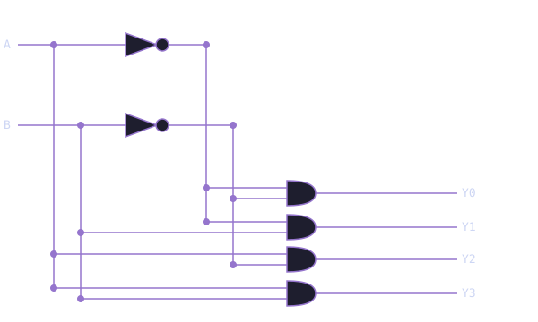

# Module 1.3: Decoders

**Block 1 — Combinational Logic**  
**Estimated time:** 45–60 minutes  
**Prerequisites:** Module 1.2 — The Multiplexer

## What you'll learn

By the end of this module you will be able to explain what a decoder does and where it shows up in real hardware, read and write a 2-to-4 decoder in TL-Verilog, understand the relationship between decoders and MUXes, build a 3-to-8 decoder from scratch, and apply decoder logic to drive a 7-segment display.

## One input, many outputs

Every circuit you have built so far takes multiple inputs and produces one output. A decoder flips that around.

A **decoder** takes an n-bit binary input and activates exactly one of 2^n outputs, specifically the one that corresponds to the input value. Everything else stays at `0`.

Think of it like a postal sorting machine. A package arrives with a zip code (your input), and the machine routes it to exactly one delivery chute (your output). All the other chutes stay closed.

Decoders are everywhere in real hardware. Every time a processor needs to figure out which instruction to execute, which memory address to access, or which register to write to, there is a decoder doing that routing work.

## The 2-to-4 decoder

The simplest useful decoder has 2 input bits and 4 output lines. With 2 bits you can represent 4 different values: 00, 01, 10, and 11. The decoder takes that 2-bit input and raises exactly one of four output lines high.

**Truth table:**

| IN[1] | IN[0] | Y[3] | Y[2] | Y[1] | Y[0] |
| ----- | ----- | ---- | ---- | ---- | ---- |
| 0     | 0     | 0    | 0    | 0    | 1    |
| 0     | 1     | 0    | 0    | 1    | 0    |
| 1     | 0     | 0    | 1    | 0    | 0    |
| 1     | 1     | 1    | 0    | 0    | 0    |

Read it row by row. When the input is `00`, only Y[0] is `1`. When the input is `01`, only Y[1] is `1`. And so on.

**Circuit diagram:**



**In TL-Verilog:**

```tlv
$y[3:0] = $in[1:0] == 2'b11 ? 4'b1000 :
           $in[1:0] == 2'b10 ? 4'b0100 :
           $in[1:0] == 2'b01 ? 4'b0010 :
                               4'b0001;
```

You already know this pattern. It is the same chained condition syntax from Module 1.2. The difference is that instead of selecting a single-bit signal, you are outputting a 4-bit one-hot value with exactly one bit set to `1`.

!!! note "One-hot encoding"

    The output pattern of a decoder, exactly one bit high at a time, is called **one-hot encoding**. It is used throughout digital design whenever you need to represent mutually exclusive states. Finite state machines, instruction decoders, and memory address logic all rely on this idea.

### See the decoder circuit in Makerchip

The embed below shows the 2-to-4 decoder circuit and its waveform. Watch the `$y` signal as `$in` cycles through 00, 01, 10, and 11. The active bit should shift from right to left like a spotlight scanning across four outputs.

<div id="mc-decoder-demo" class="makerchip-embed"></div>

??? note "What are `clk` and `reset`?"

    Makerchip always shows `clk` and `reset` in the waveform. Ignore them for now. Combinational circuits do not use a clock. The output responds instantly to the inputs with no timing involved. You will learn what the clock does when we get to sequential logic in Block 2.

## Match the waveform

Look at the waveform below. A 2-bit input `$in` produces a 4-bit output `$y`. Study the pattern and determine which output bit is active for each value of `$in`.

<div id="mc-decoder-waveform" class="makerchip-embed-small"></div>

| Cycle | $in | $y[3] | $y[2] | $y[1] | $y[0] |
| ----- | --- | ----- | ----- | ----- | ----- |
| 1     | 00  | 0     | 0     | 0     | 1     |
| 2     | 01  | 0     | 0     | 1     | 0     |
| 3     | 10  | 0     | 1     | 0     | 0     |
| 4     | 11  | 1     | 0     | 0     | 0     |

Write the TL-Verilog expression for `$y`, then verify it in the exercise below.

??? hint "How to read the pattern"

    In cycle 1, `$in` is `00` and only `$y[0]` is `1`. In cycle 4, `$in` is `11` and only `$y[3]` is `1`. Exactly one bit is active at a time, and it corresponds directly to the value of `$in`. What syntax lets you check the value of `$in` and output a specific 4-bit pattern for each case?

??? solution "Solution"

    ```tlv
    $y[3:0] = $in[1:0] == 2'b11 ? 4'b1000 :
               $in[1:0] == 2'b10 ? 4'b0100 :
               $in[1:0] == 2'b01 ? 4'b0010 :
                                   4'b0001;
    ```

    The chained condition pattern from Module 1.2 works here too. The only difference is that the output is a multi-bit one-hot value instead of a single signal.

## The decoder as the inverse of a MUX

It helps to think of decoders and MUXes as opposites. A MUX takes many inputs and routes one to the output based on a select signal. A decoder takes one input (the select) and routes it to one of many outputs.

You can in fact build a MUX out of a decoder and some AND gates. That is not something you need to do right now, but it illustrates how these building blocks compose. Understanding one deepens your understanding of the other.

## Exercise: 3-to-8 decoder

Build a 3-to-8 decoder. You have a 3-bit input `$in[2:0]`. Your output `$y[7:0]` should have exactly one bit set to `1`, specifically the bit corresponding to the value of `$in`. For example, when `$in = 3'b101` (which is 5 in decimal), `$y[5]` should be `1` and all others should be `0`.

<div id="mc-decoder-exercise" class="makerchip-embed"></div>

The starter code has `$y[7:0] = 8'b0` as a placeholder. Replace it with the correct decoder logic.

??? hint "Hint"

    Same pattern as the 2-to-4 decoder, just with 8 cases instead of 4. Work through each value of `$in` from `3'b111` down to the default, and for each one output an 8-bit value with exactly one `1` in the right position.

??? solution "Solution"

    ```tlv
    $y[7:0] = $in[2:0] == 3'b111 ? 8'b10000000 :
               $in[2:0] == 3'b110 ? 8'b01000000 :
               $in[2:0] == 3'b101 ? 8'b00100000 :
               $in[2:0] == 3'b100 ? 8'b00010000 :
               $in[2:0] == 3'b011 ? 8'b00001000 :
               $in[2:0] == 3'b010 ? 8'b00000100 :
               $in[2:0] == 3'b001 ? 8'b00000010 :
                                    8'b00000001;
    ```

    Check the waveform: as `$in` counts from 0 to 7, the single active bit in `$y` should march from right to left. If it does, your decoder is correct.

## Challenge: 7-segment display driver

Every digital clock, calculator, and scoreboard you have ever seen uses a **7-segment display**, those rectangular digits made of seven individually-controlled LED segments labeled A through G:

```
 _
|_|
|_|

Segments: A (top), B (top-right), C (bottom-right),
          D (bottom), E (bottom-left), F (top-left), G (middle)
```

To display a digit, you turn on the right combination of segments. The digit 0 uses segments A, B, C, D, E, and F with G off. The digit 1 uses only B and C. The digit 7 uses A, B, and C.

Build a circuit that takes a 3-bit input `$digit[2:0]` representing digits 0 through 7 and outputs a 7-bit signal `$seg[6:0]` where each bit controls one segment. Use the mapping `{A, B, C, D, E, F, G}` where bit 6 is segment A and bit 0 is segment G.

| Digit | A   | B   | C   | D   | E   | F   | G   | `$seg` (binary) |
| ----- | --- | --- | --- | --- | --- | --- | --- | --------------- |
| 0     | 1   | 1   | 1   | 1   | 1   | 1   | 0   | 1111110         |
| 1     | 0   | 1   | 1   | 0   | 0   | 0   | 0   | 0110000         |
| 2     | 1   | 1   | 0   | 1   | 1   | 0   | 1   | 1101101         |
| 3     | 1   | 1   | 1   | 1   | 0   | 0   | 1   | 1111001         |
| 4     | 0   | 1   | 1   | 0   | 0   | 1   | 1   | 0110011         |
| 5     | 1   | 0   | 1   | 1   | 0   | 1   | 1   | 1011011         |
| 6     | 1   | 0   | 1   | 1   | 1   | 1   | 1   | 1011111         |
| 7     | 1   | 1   | 1   | 0   | 0   | 0   | 0   | 1110000         |

<div id="mc-decoder-challenge" class="makerchip-embed"></div>

??? hint "Hint"

    Same chained condition pattern, one case per digit. For each value of `$digit`, output the 7-bit segment pattern from the table above.

??? solution "Solution"

    ```tlv
    $seg[6:0] = $digit[2:0] == 3'd7 ? 7'b1110000 :
                $digit[2:0] == 3'd6 ? 7'b1011111 :
                $digit[2:0] == 3'd5 ? 7'b1011011 :
                $digit[2:0] == 3'd4 ? 7'b0110011 :
                $digit[2:0] == 3'd3 ? 7'b1111001 :
                $digit[2:0] == 3'd2 ? 7'b1101101 :
                $digit[2:0] == 3'd1 ? 7'b0110000 :
                                      7'b1111110;
    ```

    A 7-segment display driver is one of the first things engineers build when learning FPGAs. You just built one. Every digit on a digital clock works exactly like this.

## Where this fits next

Decoders are the last pure gate-level building block you need before arithmetic. In Module 1.4 you will put everything together into an **ALU** (Arithmetic Logic Unit), the circuit at the heart of every processor. Gates, MUXes, and decoders are all the ingredients you need.

## Quick reference

| Circuit        | TL-Verilog pattern                              | What it does                     |
| -------------- | ----------------------------------------------- | -------------------------------- |
| 2-to-4 decoder | `$y[3:0] = $in == 2'b11 ? 4'b1000 : ...`        | One-hot output from 2-bit input  |
| 3-to-8 decoder | `$y[7:0] = $in == 3'b111 ? 8'b10000000 : ...`   | One-hot output from 3-bit input  |
| 7-seg driver   | `$seg[6:0] = $digit == 3'd7 ? 7'b1110000 : ...` | Segment pattern from digit value |

<style>
.makerchip-embed       { position: relative; width: 100%; height: 500px; }
.makerchip-embed-small { position: relative; width: 100%; height: 333px; }
</style>

<script type="module">
  import IdePlugin from 'https://beta.makerchip.com/dist/makerchip-plugin.js';

  const base = 'https://raw.githubusercontent.com/in-ir/makerchip-curriculum/main/code/block-1/';

  // DIAGRAM + WAVEFORM — for circuit demos
  class DiagramWaveformIDE extends IdePlugin {
    async onReady() {
      await this.setLayoutState({
        sides: {
          left:  { panes: ['Diagram'],  activePane: 'Diagram'  },
          right: { panes: ['Waveform'], activePane: 'Waveform' }
        },
        splitAt: 0.5
      });
    }
  }

  // WAVEFORM only — for match-the-waveform exercises
  class WaveformOnlyIDE extends IdePlugin {
    async onReady() {
      await this.setLayoutState({
        panes: ['Waveform'],
        activePane: 'Waveform'
      });
      await this.compile();
    }
  }

  // EDITOR + WAVEFORM — for coding exercises
  class EditorWaveformIDE extends IdePlugin {
    async onReady() {
      await this.setLayoutState({
        sides: {
          left:  { panes: ['Editor'],   activePane: 'Editor'   },
          right: { panes: ['Waveform'], activePane: 'Waveform' }
        },
        splitAt: 0.5
      });
    }
  }

  // 2-to-4 decoder demo — DIAGRAM + WAVEFORM
  if (document.getElementById('mc-decoder-demo')) {
    new DiagramWaveformIDE('mc-decoder-demo', {
      codeURL: base + '2to4-decoder.tlv'
    });
  }

  // Match the waveform — WAVEFORM only
  if (document.getElementById('mc-decoder-waveform')) {
    new WaveformOnlyIDE('mc-decoder-waveform', {
      codeURL: base + '2to4-decoder.tlv'
    });
  }

  // 3-to-8 decoder exercise — EDITOR + WAVEFORM
  if (document.getElementById('mc-decoder-exercise')) {
    new EditorWaveformIDE('mc-decoder-exercise', {
      codeURL: base + 'decoder-exercise.tlv'
    });
  }

  // 7-segment challenge — EDITOR + WAVEFORM
  if (document.getElementById('mc-decoder-challenge')) {
    new EditorWaveformIDE('mc-decoder-challenge', {
      codeURL: base + 'decoder-challenge.tlv'
    });
  }
</script>
