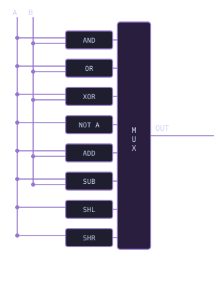

# Module 1.4: The Arithmetic Logic Unit (ALU)

**Block 1 — Combinational Logic**  
**Estimated time:** 60–90 minutes  
**Prerequisites:** Module 1.3 — Decoders

## What you'll learn

By the end of this module you will be able to explain what an ALU is and why it sits at the heart of every processor, implement all eight ALU operations in TL-Verilog, understand how addition and subtraction work in binary, explain logical and arithmetic shifting, and connect everything you have built in Block 1 into one complete circuit.

## The circuit at the heart of every processor

Every computation your computer performs, whether adding two numbers, comparing values, running a loop, or rendering a pixel, eventually comes down to one circuit: the **Arithmetic Logic Unit**, or **ALU**.

An ALU is a combinational circuit that takes two inputs and an opcode and produces one output. The opcode tells it which operation to perform. Everything else (the memory, the registers) feeds into and out of the ALU, but the ALU itself is pure combinational logic. No state, no memory. Just inputs in and output out.

You built a simplified version of this in Module 1.2. What you are building now is the real thing.

## The inputs and outputs

A standard ALU has a first operand A, a second operand B, an opcode OP that selects the operation, and a result OUT. In this module you will work with 8-bit operands and a 3-bit opcode, giving you 8 possible operations.

**Circuit diagram:**



## The eight operations

| OP     | Operation | Description                     |
| ------ | --------- | ------------------------------- |
| 3'b000 | AND       | Bitwise AND of A and B          |
| 3'b001 | OR        | Bitwise OR of A and B           |
| 3'b010 | XOR       | Bitwise XOR of A and B          |
| 3'b011 | NOT       | Bitwise NOT of A (B is ignored) |
| 3'b100 | ADD       | A plus B                        |
| 3'b101 | SUB       | A minus B                       |
| 3'b110 | SHL       | Shift A left by 1 bit           |
| 3'b111 | SHR       | Shift A right by 1 bit          |

## Logic operations

The first four operations are direct extensions of what you learned in Module 1.1. The only difference is that instead of operating on single bits, you are now operating on all 8 bits at once. TL-Verilog handles this automatically when you use multi-bit signals.

```tlv
$and[7:0] = $a[7:0] & $b[7:0];
$or[7:0]  = $a[7:0] | $b[7:0];
$xor[7:0] = $a[7:0] ^ $b[7:0];
$not[7:0] = ~$a[7:0];
```

Notice that bitwise operations use single operators (`&`, `|`, `^`, `~`) rather than the double operators (`&&`, `||`) you used for single-bit logic. The double operators are for boolean conditions. The single operators work bit by bit across the whole signal.

## Addition

Adding two binary numbers works exactly like adding decimal numbers by hand. You add each column and carry the overflow into the next position.

In Module 1.1 you built a half adder that adds two single bits and produces a sum and a carry. A full 8-bit adder chains eight of these together, passing the carry from each bit position into the next. TL-Verilog handles this automatically with the `+` operator:

```tlv
$add[7:0] = $a[7:0] + $b[7:0];
```

One line. TL-Verilog synthesizes the full carry chain for you.

!!! note "Overflow"

    When the result of an addition does not fit in 8 bits, the extra bit is lost. For example, 255 + 1 wraps around to 0. In a real processor the ALU produces a carry-out flag to signal this condition. We keep things simple here and ignore overflow, but it is worth knowing it exists.

## Subtraction and two's complement

Subtraction is where things get interesting. In hardware, you do not build a separate subtractor circuit. Instead, you reuse the adder with a clever technique called **two's complement**.

To compute A minus B, you compute A plus the two's complement of B. The two's complement of a number is obtained by inverting all its bits and adding 1:

```
two's complement of B = ~B + 1
```

So subtraction becomes:

```
A - B = A + (~B + 1) = A + ~B + 1
```

In TL-Verilog:

```tlv
$sub[7:0] = $a[7:0] + (~$b[7:0]) + 8'b1;
```

Or more simply, since TL-Verilog's `-` operator handles this automatically:

```tlv
$sub[7:0] = $a[7:0] - $b[7:0];
```

!!! note "Why two's complement?"

    Two's complement is the standard way computers represent negative numbers. It has a remarkable property: addition and subtraction use exactly the same hardware. Your processor does not have a separate subtraction circuit. It feeds the two's complement into the adder. This is one of the most elegant ideas in computer architecture.

## Shifting

A **shift** moves all the bits in a signal left or right by a number of positions. Bits that shift out of range are lost and the empty positions are filled with zeros.

Shift left by 1 (SHL): every bit moves one position to the left. The leftmost bit is lost and a `0` comes in from the right.

```
Before: 0 1 1 0 1 0 1 0
After:  1 1 0 1 0 1 0 0
```

Shift right by 1 (SHR): every bit moves one position to the right. The rightmost bit is lost and a `0` comes in from the left.

```
Before: 0 1 1 0 1 0 1 0
After:  0 0 1 1 0 1 0 1
```

Shifting left by 1 is equivalent to multiplying by 2. Shifting right by 1 is equivalent to dividing by 2, ignoring remainders. Processors use shifts constantly for fast multiplication and division.

In TL-Verilog:

```tlv
$shl[7:0] = $a[7:0] << 1;
$shr[7:0] = $a[7:0] >> 1;
```

!!! tip "Other types of shifts"

    The shifts above are called **logical shifts** because empty positions always fill with zero. Two other variants are worth knowing. An **arithmetic right shift** fills the empty position with the sign bit (the leftmost bit) instead of zero, which preserves the sign of a negative number in two's complement. A **circular shift** wraps the bit that falls off one end back in on the other end so no bits are ever lost. Both appear regularly in real processors and cryptographic hardware.

## Putting it all together

Now that you have all eight results, you select the right one using the opcode, exactly the MUX pattern from Module 1.2:

```tlv
$out[7:0] = $op[2:0] == 3'b111 ? $shr :
             $op[2:0] == 3'b110 ? $shl :
             $op[2:0] == 3'b101 ? $sub :
             $op[2:0] == 3'b100 ? $add :
             $op[2:0] == 3'b011 ? $not :
             $op[2:0] == 3'b010 ? $xor :
             $op[2:0] == 3'b001 ? $or  :
                                  $and;
```

The complete ALU in TL-Verilog:

```tlv
$and[7:0] = $a[7:0] & $b[7:0];
$or[7:0]  = $a[7:0] | $b[7:0];
$xor[7:0] = $a[7:0] ^ $b[7:0];
$not[7:0] = ~$a[7:0];
$add[7:0] = $a[7:0] + $b[7:0];
$sub[7:0] = $a[7:0] - $b[7:0];
$shl[7:0] = $a[7:0] << 1;
$shr[7:0] = $a[7:0] >> 1;

$out[7:0] = $op[2:0] == 3'b111 ? $shr :
             $op[2:0] == 3'b110 ? $shl :
             $op[2:0] == 3'b101 ? $sub :
             $op[2:0] == 3'b100 ? $add :
             $op[2:0] == 3'b011 ? $not :
             $op[2:0] == 3'b010 ? $xor :
             $op[2:0] == 3'b001 ? $or  :
                                  $and;
```

Ten lines. That is a complete ALU.

### See the ALU in Makerchip

The embed below shows the ALU circuit and its waveform. Watch `$out` change as `$op` changes over time.

<div id="mc-alu-demo" class="makerchip-embed"></div>

??? note "What are `clk` and `reset`?"

    Makerchip always shows `clk` and `reset` in the waveform. Ignore them for now. Combinational circuits do not depend on a clock. The output responds instantly to the inputs. You will learn what the clock does when we get to sequential logic in Block 2.

## Reverse engineer the waveform

Look at the waveform below. Two 8-bit inputs `$a` and `$b` and a 3-bit opcode `$op` produce an output `$out`. Study the output values and work out which operation is being applied each time the opcode changes.

<div id="mc-alu-waveform" class="makerchip-embed-small"></div>

??? hint "How to read the pattern"

    Look at each section where `$op` is constant and ask: what relationship does `$out` have to `$a` and `$b`? Is it a bitwise combination? A sum? A shift? Match what you see to the opcode table above.

??? solution "Solution"

    When `$op` is `3'b000`, `$out` has a `1` only where both `$a` and `$b` have `1` — that is AND. When `$op` is `3'b001`, `$out` has a `1` wherever either input has `1` — that is OR. When `$op` is `3'b100`, `$out` is the sum of `$a` and `$b` — that is ADD. When `$op` is `3'b110`, `$out` is `$a` shifted one position left — that is SHL. Working backwards from output patterns to operations is exactly what hardware engineers do when debugging a processor.

## Exercise: Extend the ALU with XNOR

Add a ninth operation to the ALU: XNOR. XNOR is the inverse of XOR: the output is `1` when both inputs are the same. Extend the opcode to 4 bits and add XNOR as operation `4'b1000`.

<div id="mc-alu-exercise" class="makerchip-embed"></div>

The starter code has the 8-operation ALU already working. Add the XNOR operation and update the opcode MUX to include it.

??? hint "Hint"

    XNOR is just XOR with the output inverted. Compute it as an intermediate signal first, then add it as the first case in your opcode chain with `$op[3:0] == 4'b1000`.

??? solution "Solution"

    ```tlv
    $and[7:0]  = $a[7:0] & $b[7:0];
    $or[7:0]   = $a[7:0] | $b[7:0];
    $xor[7:0]  = $a[7:0] ^ $b[7:0];
    $xnor[7:0] = ~($a[7:0] ^ $b[7:0]);
    $not[7:0]  = ~$a[7:0];
    $add[7:0]  = $a[7:0] + $b[7:0];
    $sub[7:0]  = $a[7:0] - $b[7:0];
    $shl[7:0]  = $a[7:0] << 1;
    $shr[7:0]  = $a[7:0] >> 1;

    $out[7:0] = $op[3:0] == 4'b1000 ? $xnor :
               $op[3:0] == 4'b0111 ? $shr  :
               $op[3:0] == 4'b0110 ? $shl  :
               $op[3:0] == 4'b0101 ? $sub  :
               $op[3:0] == 4'b0100 ? $add  :
               $op[3:0] == 4'b0011 ? $not  :
               $op[3:0] == 4'b0010 ? $xor  :
               $op[3:0] == 4'b0001 ? $or   :
                                     $and;
    ```

## Challenge: Flag generation

Many processors use **flags** to describe properties of an ALU result, allowing the processor to make decisions based on the outcome of an operation. Note that not all instruction set architectures use flags — this is one design choice among many.

Add the following flags to your ALU. The **zero flag** `$zero` should be `1` if `$out` is all zeros. The **negative flag** `$neg` should be `1` if the most significant bit of `$out` is `1`, indicating a negative number in two's complement. The **carry flag** `$carry` should be `1` if the addition produced a carry out of the 8th bit.

<div id="mc-alu-challenge" class="makerchip-embed"></div>

??? hint "Hint"

    The zero flag is a NOR of all output bits. If any bit is `1`, the result is not zero. The negative flag is simply `$out[7]`. For the carry flag, compute addition with a 9-bit result and take the extra bit: `$add_with_carry[8:0] = {1'b0, $a} + {1'b0, $b}` then `$carry = $add_with_carry[8]`.

??? solution "Solution"

    ```tlv
    $and[7:0] = $a[7:0] & $b[7:0];
    $or[7:0]  = $a[7:0] | $b[7:0];
    $xor[7:0] = $a[7:0] ^ $b[7:0];
    $not[7:0] = ~$a[7:0];
    $add[7:0] = $a[7:0] + $b[7:0];
    $sub[7:0] = $a[7:0] - $b[7:0];
    $shl[7:0] = $a[7:0] << 1;
    $shr[7:0] = $a[7:0] >> 1;

    $out[7:0] = $op[2:0] == 3'b111 ? $shr :
               $op[2:0] == 3'b110 ? $shl :
               $op[2:0] == 3'b101 ? $sub :
               $op[2:0] == 3'b100 ? $add :
               $op[2:0] == 3'b011 ? $not :
               $op[2:0] == 3'b010 ? $xor :
               $op[2:0] == 3'b001 ? $or  :
                                    $and;

    $zero  = ($out[7:0] == 8'b0);
    $neg   = $out[7];
    $add_with_carry[8:0] = {1'b0, $a[7:0]} + {1'b0, $b[7:0]};
    $carry = $add_with_carry[8];
    ```

    In processors that use flags, when you write `if (a == b)` in C, the compiler generates a SUB instruction and checks the zero flag. When you write `if (a < 0)`, it checks the negative flag. You just built the hardware that makes those decisions possible.

## Where this fits next

You have now completed Block 1. You can build any combinational circuit from gates, route signals with MUXes, decode binary values, and perform arithmetic and logic operations with a full ALU. These are the building blocks of every digital system ever made.

In Block 2 you will add the missing ingredient: **state**. You will learn how circuits can remember values over time and use that to build counters, registers, and your first finite state machine.

## Quick reference

| Operation | TL-Verilog  | Description                    |
| --------- | ----------- | ------------------------------ |
| AND       | `$a & $b`   | Bitwise AND                    |
| OR        | `$a \| $b`  | Bitwise OR                     |
| XOR       | `$a ^ $b`   | Bitwise XOR                    |
| NOT       | `~$a`       | Bitwise NOT                    |
| ADD       | `$a + $b`   | Addition                       |
| SUB       | `$a - $b`   | Subtraction (two's complement) |
| SHL       | `$a << 1`   | Logical shift left             |
| SHR       | `$a >> 1`   | Logical shift right            |

<style>
.makerchip-embed       { position: relative; width: 100%; height: 500px; }
.makerchip-embed-small { position: relative; width: 100%; height: 333px; }
</style>

<script type="module">
  import IdePlugin from 'https://beta.makerchip.com/dist/makerchip-plugin.js';

  const base = 'https://raw.githubusercontent.com/in-ir/makerchip-curriculum/main/code/block-1/';

  class DiagramWaveformIDE extends IdePlugin {
    async onReady() {
      await this.setLayoutState({
        sides: {
          left:  { panes: ['Diagram'],  activePane: 'Diagram'  },
          right: { panes: ['Waveform'], activePane: 'Waveform' }
        },
        splitAt: 0.5
      });
    }
  }

  class WaveformOnlyIDE extends IdePlugin {
    async onReady() {
      await this.setLayoutState({
        panes: ['Waveform'],
        activePane: 'Waveform'
      });
      await this.compile();
    }
  }

  class EditorWaveformIDE extends IdePlugin {
    async onReady() {
      await this.setLayoutState({
        sides: {
          left:  { panes: ['Editor'],   activePane: 'Editor'   },
          right: { panes: ['Waveform'], activePane: 'Waveform' }
        },
        splitAt: 0.5
      });
    }
  }

  if (document.getElementById('mc-alu-demo')) {
    DiagramWaveformIDE.create('mc-alu-demo', {
      codeURL: base + 'alu.tlv'
    });
  }

  if (document.getElementById('mc-alu-waveform')) {
    WaveformOnlyIDE.create('mc-alu-waveform', {
      codeURL: base + 'alu.tlv'
    });
  }

  if (document.getElementById('mc-alu-exercise')) {
    EditorWaveformIDE.create('mc-alu-exercise', {
      codeURL: base + 'alu-exercise.tlv'
    });
  }

  if (document.getElementById('mc-alu-challenge')) {
    EditorWaveformIDE.create('mc-alu-challenge', {
      codeURL: base + 'alu-challenge.tlv'
    });
  }
</script>
